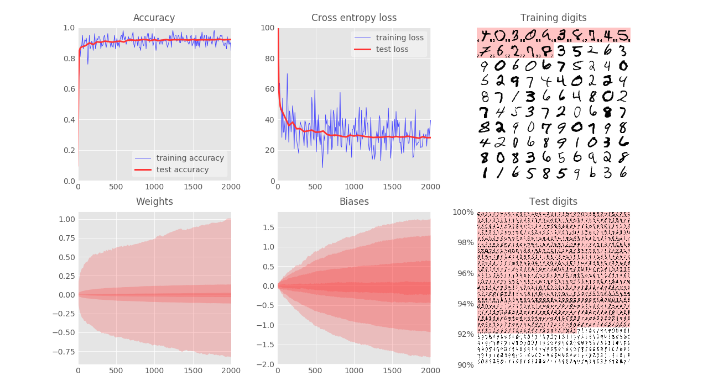
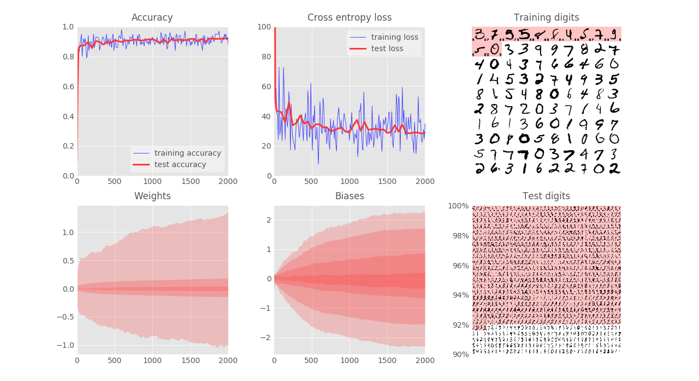
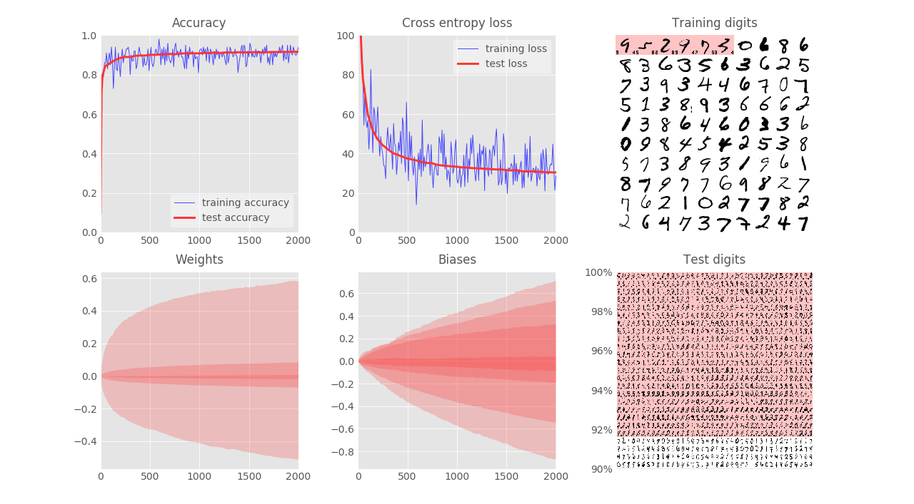
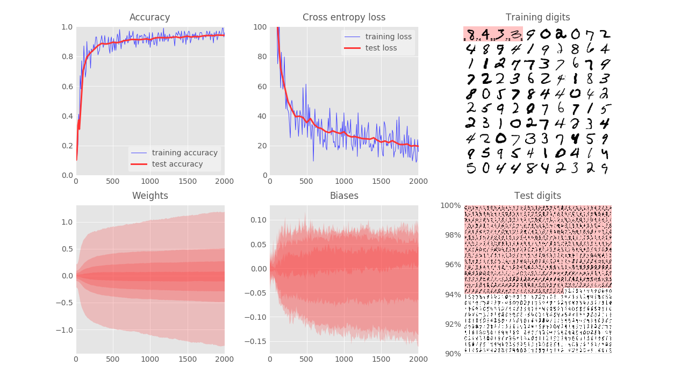
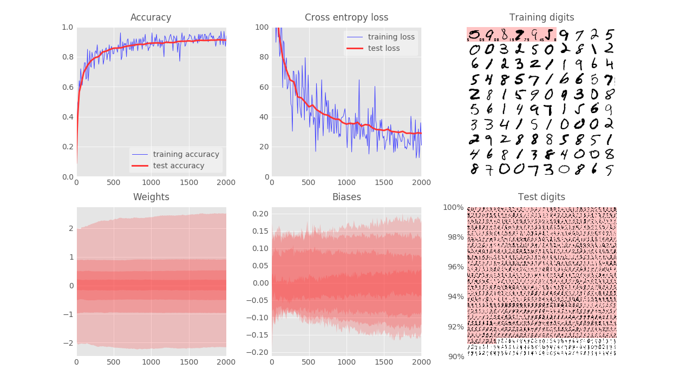
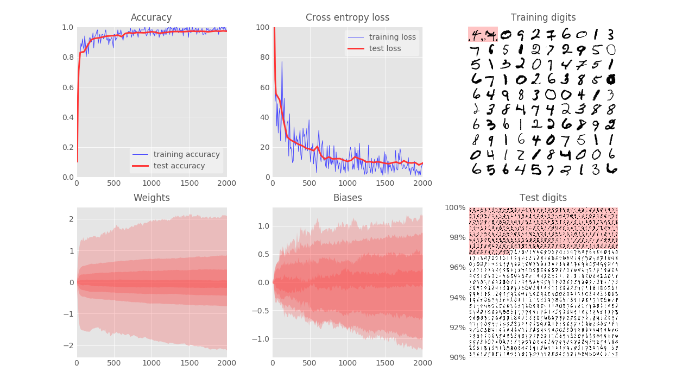
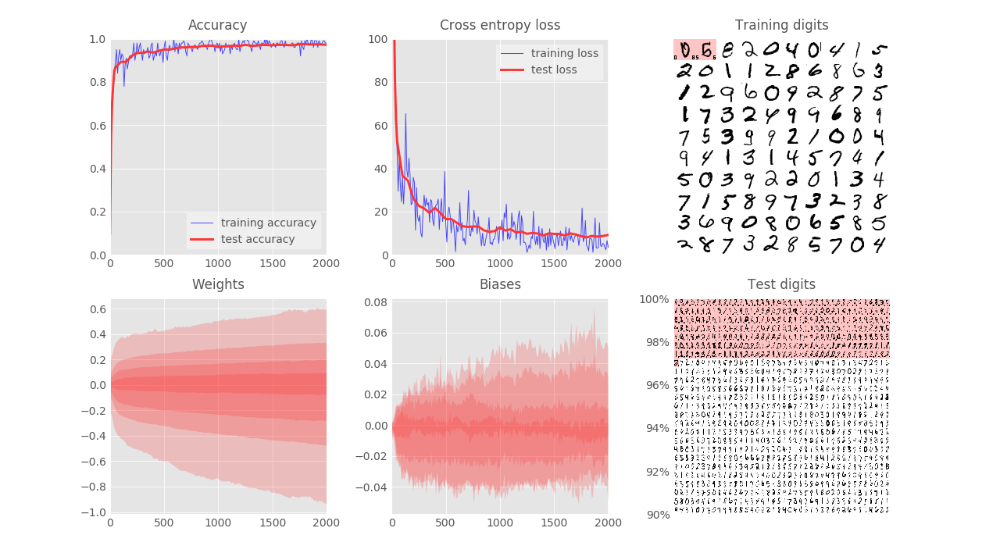

- [TensorFlow and Deep Learning without a PhD, Part 1 (Google Cloud Next '17)](https://youtu.be/u4alGiomYP4)

- [codelabs.developers.google.com](https://codelabs.developers.google.com/codelabs/cloud-tensorflow-mnist/#0)

- 50000 images in training site
- 10000 images in testing site

*In the tests below the test set will serve more as a validation test than a real test set (which we must not touch during the training)*

---
### 1. No hidden layer
- (28x28x1) -- (10)
- weights (784x10) and bias (10) both **initialized at $0$**
- (Stochastic) Gradient Descent with learning rate = $0.5\%$ for batch $100$

**Result:**
- Print training loss and accuracy as well as testing loss and accuracy
- Get test accuracy $92\%$ after $2000$ iterations

**Comment:**
Not usable in production (imagine detecting zip code application)

**Test with other parameters**
- learning rate = $1\%$ ==> quite similar result, but the loss function fluctuates more.

- learning rate = $2\%$ ==> explosion
- learning rate = $0.1\%$ ==> converge slower but smoother, (test accuracy reaches $91.5\%$ after $2000$ iterations)

---
### 2. Two hidden layers
- (28x28x1) -- (200) -- (100) -- (10)
- weights (784x200), (200x100), (100x10) **initialized using truncated_normal with std = 0.1**
- bias are all **initialized at 0**
- **sigmoid** activation
- (Stochastic) Gradient Descent with learning rate = $0.5\%$ for batch $100$

**Result:**
- Test accuracy (which means validation accuracy in this post) reaches $94.3\%$ after $2000$ iterations:

**Weight initialization:**
- Modify the weights initialization with **std = 1**: the convergence is worse ($91.3\%$). This reconfirms the importance of weights initialization.

 

Note that the Xavier initialization is $var(W) = 1/N_{in}$ so with our numbers of input = 784, 200, 100 for each layer, the first std = 0.1 is more or less the Xavier initialization.

**Optimizer:**
- Use MomentumOtimizer with the same learning rate = $0.5\%$ and momentum=$0.9$, the convergence is much faster than SGD and the (test) validation accuracy reaches $97.3\%$ after $2000$ iterations:

- Use AdamOptimizer with the same learning rate = $0.5\%$, the convergence is much faster than SGD and the (test) validation accuracy reaches $97.5\%$ after $2000$ iterations:

