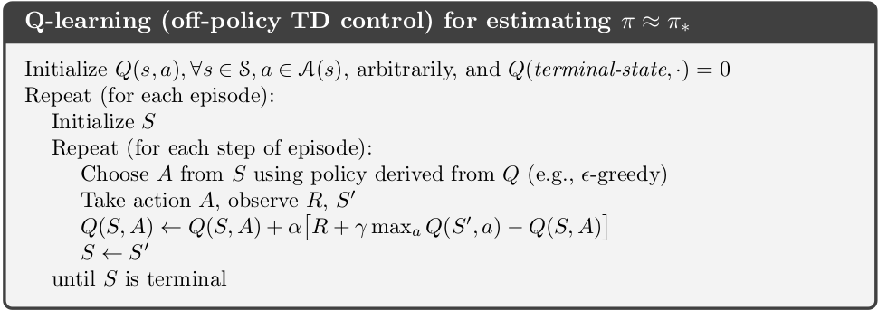

SARSA and Q-learning are two reinforcement learning methods that do not require model knowledge, only observed rewards from many experiment runs. Unlike MC which we need to wait until the end of an episode to update the state-action value function $Q(s,a)$, SARSA and Q-learning make the update after each step.

In both cases the policy followed by the agent is $\epsilon$-greedy which is important for exploration.

In both methods, during each episode, from a current state $s$, we take an action $a$ from $s$ to another new state $s'$, observing a reward $r$. The action $a$ is taken following the current $\epsilon$-greedy policy (given by the current Q-value function). Now we need to update $Q(s,a)$:
- In SARSA, this is done by choosing another action $a'$ following the **same current policy** above and using $r + \gamma Q(s',a')$ as target.

$$
Q(s,a) = Q(s,a) + \alpha [ r + \gamma Q(s',a') - Q(s,a)) ]
$$

SARSA is called *on-policy* learning because new action $a'$ is chosen using the same $epsilon$-greedy policy as the action $a$, the one that generated $s'$.

{:class="img-responsive"}

- In Q-learning, this is done by choosing the **greedy action $a^g$**, i.e the action that maximize the Q-value function at the new state Q(s', a):

$$
Q(s,a) = Q(s,a) + \alpha [ r + \gamma Q(s',a^{g}) - Q(s,a)) ]
$$

or equivalently

$$
Q(s,a) = Q(s,a) + \alpha [ r + \gamma \max_{u} Q(s',u) - Q(s,a)) ]
$$

Q-learning is called *off-policy* learning because the new action $a^g$ is taken as greedy, not using the current policy.

{:class="img-responsive"}

After this update, we replay the process from the new state $s'$ until we reach the end state.

#### Some comments:
- The new action $a'$ and $a^g$ are not actually **taken**, but only **chosen**, to compute the targets in the updating equations, i.e $r + \gamma Q(s',a')$ for SARSA and $r + \gamma Q(s',a^{g})$ for Q-learning.
- The action $a$ determines the next state we will consider next for updating. In both cases $a$ is chosen using the current $\epsilon$-greedy policy, which guarantees the exploration.
- SARSA will learn the optimal $\epsilon$-greedy policy, i.e, the  Q-value function will converge to a optimal Q-value function but in the space of $\epsilon$-greedy policy only (as long as each state action pair will be visited infinitely). We expect that in the limit of $\epsilon$ decaying to $0$, SARSA will converge to the overall optimal policy. I quote here a paragraph from *'Reinforcement Learning: An Introduction' book by Sutton & Barto, section 6.4:*

> The convergence properties of the Sarsa algorithm depend on the nature of the
policy’s dependence on Q. For example, one could use ε-greedy or ε-soft policies.
According to Satinder Singh (personal communication), Sarsa converges with prob-
ability 1 to an optimal policy and action-value function as long as all state–action
pairs are visited an infinite number of times and the policy converges in the limit
to the greedy policy (which can be arranged, for example, with ε-greedy policies by
setting ε = 1/t), but this result has not yet been published in the literature.

- Q-learning on the other hand will converge to the optimal policy $q_*$

## Cliff walking

To illustrate the difference of the 2 methods, we consider a grid-world example of cliff walking, which is mentioned in the Sutton & Barto book as well, but here I try to explain it in more details.

{:class="img-responsive"}

The grid-word is of size 4x12, where the cliff is on the last row of size 10 between the start and end state. Each step that takes the agent to fall inside cliff will receive -100 reward, otherwise -1.

We will take $\epsilon = 0.1$ in our experiments. At each step, the agent has $10\%$ of not following the greedy action (or the action with the highest Q value).

**Results:**
- As noted before, SARSA learns a *$\epsilon$-greedy optimal policy*, and this policy is describe by the *safe path* in the figure, which shows the greedy direction of this optimal policy. Why the agent prefers to go further away from the cliff? Because suppose that we are on the 3rd row, LEFT and RIGHT action will make us still staying on this row and there is 10%/4 = 2.5% chance that we will go into the Cliff afterward. Going DOWN is disaster immediately. Remember that in SARSA we choose the next action based on the same $\epsilon$-greedy policy. *With respect* to any $\epsilon$-greedy policy with $\epsilon >0$ not so small, the cells just above the cliff are dangerous and should have small value function.
- Q-Learning, on the other hand learns directly the optimal policy which is described by the *optimal* path. In the learning process, since the agent always explore, in Q-learning we have **more chances** that the agent will go into the cliff because the agent likes to stay more in the third row (the greedy direction). However this will only affect what are the states we will visit during our learning process, Q-learning **still learns the optimal policy or optimal $q_{*}$ value function**. Remember that the target in the updating equation contains $\max_u Q(s',u)$.

This can be still confusing and I am not sure I fully understood, but I think the concepts and differences are profound even though the updating equations look like very similar.

So let's look into detail at the value of the resulted state-action value function.
`[Q(s, UP), Q(s, RIGHT), Q(s, DOWN), Q(s, LEFT)]` at different states $s$ or cell in the grid-world. Note $Q_{sarsa}$ and $Q_q$ the state-action value obtained from SARSA and Q-Learning respectively (after 10000 simulations, $\epsilon = 0.1$).

- At cell $s = (3,12)$ just above the goal: $Q_{sarsa}((3,12)) = [-6.1,  -2.0,  -1.,  -7.9]$  and $Q_{q}((3,12)) = [-3.,  -2.,  -1.,  -3.]$. Here we have perfect convergence at this state for $Q_q((3,12)) = q_*((3,12))$ the optimal state-value function. In SARSA, the value functions are more negatives since the underlying policy is $\epsilon$-greedy.

- At cell $s = (3,11)$, one cell to the left of the cell above:  $Q_{sarsa}((3,11)) = [-6.9,  -15.6,  -99.,  -20.9]$  and $Q_{q}((3,11)) = [-4.,  -2.,  -100.,  -4.]$
